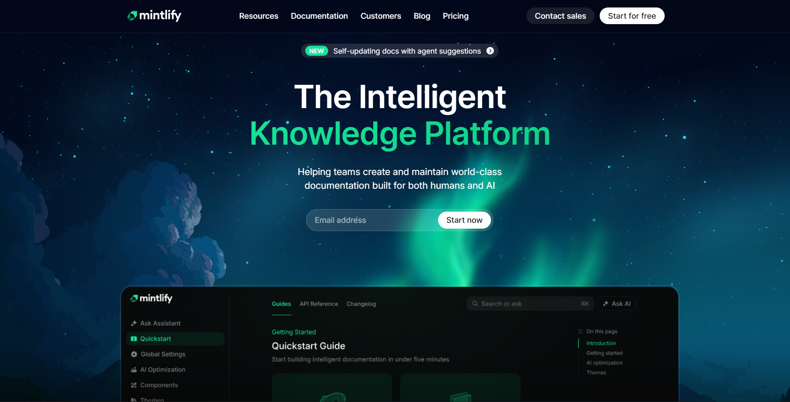

<p align="center">
	
</p>

<h1 align="center">Mintlify Clone (Landing Page UI)</h1>

<p align="center">Modern landing page UI clone of the Mintlify website. HTML &amp; CSS.</p>

<p align="center">
	
	
</p>

## Live Demo

You can view the live demo of this landing page clone here: [Live Demo](https://mintlify-ui-clone-piyus.vercel.app/)

## Features

This landing page clone includes the following sections:

- **Hero Section** - Eye-catching introduction with email signup form
- **Companies Section** - Showcase of trusted partner companies
- **Features Section** - Three-card grid highlighting key features (LLMs.txt & MCP, Agent, Assistant)
- **AI Assistant Section** - Three feature cards demonstrating AI capabilities
- **Enterprise Section** - Customer story with Anthropic case study, partnership features, and company logos

## Usage

To use this code:

1. Clone or download this repository
2. Open `index.html` in your browser
3. Customize the content and styles in `main.css` as needed
4. Replace placeholder images in the `assets` folder with your own

## Structure

```
mintlify-clone/
├── index.html          # Main HTML file
├── main.css           # Stylesheet
├── assets/            # Images and SVG files
│   ├── hero-image.png
│   ├── bg-image.svg
│   └── ...
└── README.md          # This file
```

## Acknowledgements

- Inspired by the original [Mintlify](https://mintlify.com/) website design
- Built as a practice project for HTML and CSS skills
- Features modern CSS techniques including Grid, Flexbox, and CSS custom properties

---

<p align="center">Made with 💚 for learning purposes</p>
